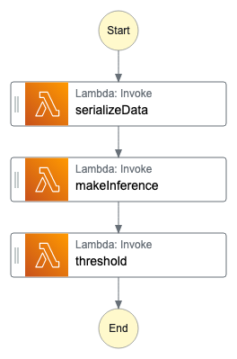
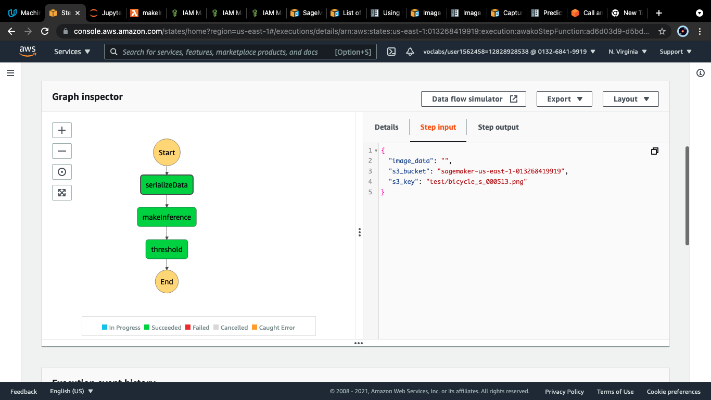
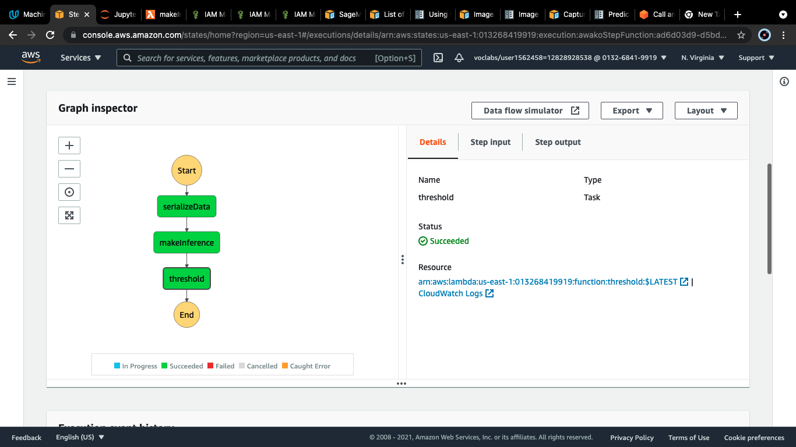

# Awakọ̀

`Awakọ̀` means driver in Yorùbá. 

## Introduction
This project trains an image classification model in Amazon SageMaker to distinguish the vehicle of delivery drivers. This information is used to assign delivery task. 

The model is trained on 1000 examples and validated on a further 200 examples. No data augmentation was performed during this training run. This may investigated later to improve model performance.

The model was deployed and used to compose a three-layer step function that serializes incoming image data, makes predictions on it and filters away inferences below a chosen confidence. Each layer in the step function uses a lambda function.

Model training and deployment code are in [workflow.ipynb](awako/workflow.ipynb) and the handlers for the lambda functions are in [lambda](awako/lambda).

## Images
# Step Function Graph

### Working Step Functions

